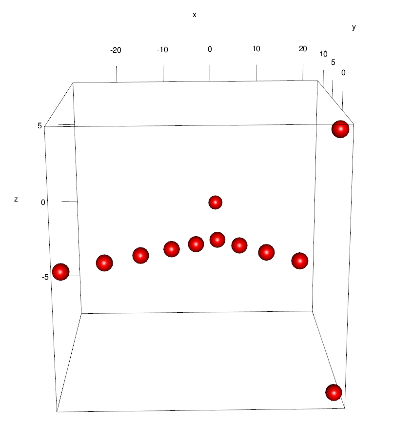

```{r setup, include=FALSE}
knitr::opts_chunk$set(echo = TRUE)
```

# 1. Uzdevums: MDS, pilsētu savstarpējie attālumi

Vispirms jāielādē dati. Šajā gadījumā izvēlēta datu kopa WG22 ("West Germany"), kur apkopoti attālumi starp 22 Rietumvācijas pilsētām (datu kopa acīmredzot nav tā jaunākā), pieejama [Floridas Štata universitātes mājas lapā kopā ar citām pilsētu attālumu datu kopām.](https://people.sc.fsu.edu/~jburkardt/datasets/cities/cities.html)

```{r}
dist.de <- read.table("wg22_dist.txt")
names <- read.table("wg22_name.txt")
```

Pēc tam veic dimensiju redukciju:

```{r}
fit <- cmdscale(dist.de, eig = TRUE, k = 2)
```

Iznesot iegūtos punktus 2-dimensiju koordinātu sistēmā un grafiski attēlojot, redzams, ka to izkārtojums ir līdzīgs Vācijas kartei, taču iespējams, nepieciešams pagriezt (samainīt x-y asis) un/vai kādu no asīm apgriezt otrādi (reizināt ar -1).

](german-cities.jpg){width=60%}

```{r, fig.width=8, fig.height=6}
x <- fit$points[, 1]
y <- fit$points[, 2]
plot(x,y,xlim=c(-150,150),ylim=c(-120,120))
text(x,y,labels=names$V1)
```

Veicot korekcijas:

```{r, fig.width=6, fig.height=8}
x <- -x
y <- -y
plot(y,x,xlim=c(-120,120),ylim=c(-150,150))
text(y,x,labels=names$V1)
```


\newpage

# 2. Uzdevums: ISOMAP

## Kļūda kodā

Vispirms, piebilde par kļūdu "ProjectionBasedClustering" modulī. Kļūda atrodama izejas koda failā [Isomap.R (Github, ProjectionBasedClustering)](https://github.com/Mthrun/ProjectionBasedClustering/blob/master/R/Isomap.R), 44 rindā:

```{r, eval=FALSE}
res=vegan::isomap(Distances,ndim = 2,k=40,fragmentedOK=T, path = "shortest")
```

Tā vietā, lai izmantotajai funkcijai padotu lietotāja dotos parametrus, tiek izmantotas konstantes. To var labot, nokopējot visu funkciju savā koda failā un nomainot rindu uz

```{r, eval=FALSE}
res=vegan::isomap(Distances,ndim = OutputDimension,k=k,fragmentedOK=T, path = "shortest")
```

vai arī tiešā veidā iekļaujot bibliotēku "vegan" un iekopējot tikai vajadzīgās rindas no funkcijas (izlaižot dažādas pārbaudes un grafika zīmēšanu):

```{r, message=FALSE}
library(vegan)
Isomap  = function(Distances,k,OutputDimension=2){
  res=vegan::isomap(Distances,ndim = OutputDimension,k=k,fragmentedOK=T, path = "shortest")
  ProjectedPoints=res$points
  return(list(ProjectedPoints=ProjectedPoints))
}
```

## Datu apstrāde

Datus ielasa ar 'foreign' moduļa palīdzību:

```{r}
library(foreign)
data <- read.arff('unbalanced.arff')
```

Lai varētu klases "Active" un "Inactive" datos attēlot kā krāsas, jāuzraksta funkcija, kas ģenerē attēlu:

```{r}
colors <- function(status) {
  sapply(status, function(i) {
    if (i == "Active"){
      "red"
    } else {
      "blue"
    }
  })
}
color_row <- colors(data$Outcome)
```

No datiem izgriež klases rindu

```{r}
trimmed <- data[,1:length(data[1,])-1]
```

un aprēķina pilno Eiklīda distanču matricu:

```{r}
distances <- as.matrix(dist(as.matrix(trimmed)))
```

No distanču matricas var iegūt ISOMAP dimensiju redukcijas algoritma rezultātu. Koda paraugs (k=5):

```{r, eval=FALSE}
fit <- Isomap(distances, 5, 3)
x <- fit$ProjectedPoints[,1]
y <- fit$ProjectedPoints[,2]
z <- fit$ProjectedPoints[,3]
```

Iespējams ģenerēt 3-dimensionālus, interaktīvus grafikus, taču tos dokumentā tiešā veidā iekļaut nevar, tāpēc katrai k vērtībai iekļauts iepriekš ģenerēts attēls. Kods ir sekojošs:

```{r, eval=FALSE}
library(rgl)
plot3d(x,y,z,
       col=color_row,
       type="s",
       radius=3.5)
```

Grafiki ģenerēti k vērtībām 1,2,3,5,10,40. Ar k vērtību 1 tuvāko kaimiņu grafs nav sakarīgs, tāpēc Isomap funkcija automātiski atgriež tikai rezultātu lielākajai sakarīgai komponentei, kurā visi elementi ir "Active":

```{r, echo=FALSE, fig.height=3}
fit <- Isomap(distances, 1, 2)
x <- fit$ProjectedPoints[,1]
y <- fit$ProjectedPoints[,2]
plot(x,y,col=color_row)
```

{height=30%}

\newpage

K = 2, vēl joprojām grafs nav sakarīgs taču tagad iekļauti arī daudzi "Inactive" elementi:

```{r, echo=FALSE, fig.height=3}
fit <- Isomap(distances, 2, 2)
x <- fit$ProjectedPoints[,1]
y <- fit$ProjectedPoints[,2]
plot(x,y,col=color_row)
```

{height=50%}

\newpage

K = 3, šoreiz grafs jau ir sakarīgs, taču projekcijas struktūra vēl arvien ir izteikti "izstiepta", t.i., elementi veido garas rindas, jo dominē grafu distances, nevis telpiskās:

```{r, echo=FALSE, fig.height=3}
fit <- Isomap(distances, 3, 2)
x <- fit$ProjectedPoints[,1]
y <- fit$ProjectedPoints[,2]
plot(x,y,col=color_row)
```

{height=50%}

\newpage

K = 5, redzams, ka projekcija sāk telpiski "izplūst", lielāka nozīme lokāli ir Eiklīda, nevis telpiskām distancēm, veidojas nepārtraukta virsma:

```{r, echo=FALSE, fig.height=3}
fit <- Isomap(distances, 5, 2)
x <- fit$ProjectedPoints[,1]
y <- fit$ProjectedPoints[,2]
plot(x,y,col=color_row)
```

{height=50%}

\newpage

K = 10, virsma kļūst līdzenāka:

```{r, echo=FALSE, fig.height=3}
fit <- Isomap(distances, 10, 2)
x <- fit$ProjectedPoints[,1]
y <- fit$ProjectedPoints[,2]
plot(x,y,col=color_row)
```

{height=50%}

\newpage

K = 40, projicēto punktu kopas "grafa" pazīmes vairs nav redzamas:

```{r, echo=FALSE, fig.height=3}
fit <- Isomap(distances, 40, 2)
x <- fit$ProjectedPoints[,1]
y <- fit$ProjectedPoints[,2]
plot(x,y,col=color_row)
```

{height=50%}

\newpage

## Secinājumi

Interesants fenomens ir tas, ka ar k=1, lielākā sakarīgā punktu kopa ir visi 12 klases "Active" punkti, un iekļauts nav neviens "Inactive" punkts. Taču tiklīdz k>1, "Active" punkti tiek šķietami izkaisīti "Inactive" punktu jūrā. Šis fakts liek palauzīt galvu, taču ticamākais izskadrojums varētu būt šāds: kaut kur daudzdimensionālā telpā var atrast 2 hipervirsmas, starp kurām attālums visur ir lielāks nekā tas starp katriem kopas active "kaimiņiem" (tuvākajiem punktiem) taču mazāks nekā attālums starp punktiem, kas neatrodas blakus. Uz vienas no virsmām atrodas visi "Active" punkti, uz otras - "Inactive". Tāpēc ar k=1 "Active" punktu kaimiņi ir tikai citi kopas "Active" punkti, taču ar k>1 var atrast daudzus "Inactive" punktus, kas ir tuvāki nekā nākamie tuvākie "Active" punkti, jo "Inactive" kopa ir daudzkārt lielāka un "biezāka" nekā "Active" kopa.

Piemērs kā šāda struktūra varētu izskatīties divās dimensijās:


Savukārt fakts, ka šī struktūra nav redzama ne 2-dimensiju, ne 3-dimensiju projekcijās varētu būt skaidrojams ar to, ka šo struktūru var "redzēt" tikai augstākās dimensijās - piemēram var salīdzināt 2-d un 3-d attēlu k=1 gadījumā (5.lpp), kur divi punkti ar ievērojamu attālumu tiek saspiesti vienā, ja tiek atmests īpašvektors, kas ir lielākā komponente to starpībā (punkti labajā apakšējā 2-d attēla stūrī saspiežas gandrīz kopā, kad tiek atmesta z-ass).