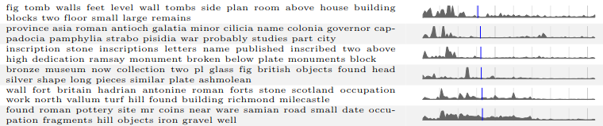
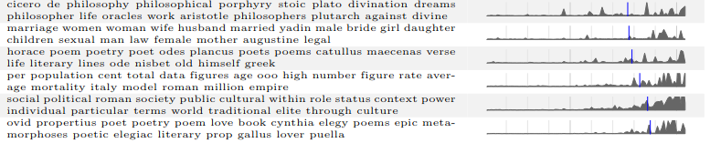
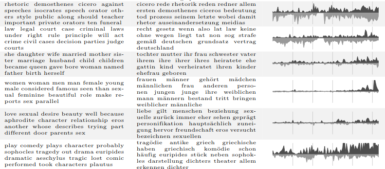

```{r setup, include=FALSE}
knitr::opts_chunk$set(echo = TRUE)
```

# 1. Uzdevums - dimensiju redukcijas algoritmi ar dažādām distances metrikām

Izmantotie algoritmi - t-sne, UMAP. Izmantotās distances metrikas: *manhattan, euclidean, chebishev* t-sne gadījumā, *manhattan, euclidean, cosine* - UMAP.

## Datu apstrāde

Kā parasti, ielasa datus, nogriež klases kolonnu un izveido atsevišķu vektoru datu punktu klasēm.

```{r}
library(foreign)
trim <- function(df){
  df[,1:length(df[1,])-1]
}
colors <- function(df) {
  sapply(df, function(x) {
    if (x == "b") { "blue" } 
    else { "red" }})
}
data <- read.arff("ionosphere.arff")
trimmed <- trim(data)
col_row <- colors(data[,length(data[1,])])
```

Funkcija grafiku zīmēšanai ar t-sne:

```{r}
library(tsne)
plot.tsne <- function(df, distance="", perp=30, iter=400, class=NULL, plt=T, k=2, ret=F) {
  transformed <- tsne(df, k = k, perplexity = perp,
                      initial_dims = length(df[1,]), max_iter = iter)
  x <- transformed[,1]
  y <- transformed[,2]
  if (plt) {
    plot(x,y,col=class,xlab="comp1",
         ylab="comp2",
         main=sprintf("Distance metric: %s", distance))
  }
  if (ret) {
    transformed
  }
}
```
\newpage
Funkcija grafiku zīmēšanai ar UMAP:

```{r}
library(umap)
plot.umap <- function(df, config, class=NULL, distance="", knn=15, plt=T, ret=T) {
  transformed <- umap(df, config)
  x <- transformed$layout[,1]
  y <- transformed$layout[,2]
  if (plt) {
    plot(x,y,col=class,xlab="comp1",
         ylab="comp2",
         main=sprintf("Distance metric %s, knn = %d", distance, knn))
  }
  if (ret) {
    transformed
  }
}
```

t-sne realizācija piedāvā variantu datu kopu saņemt distanču matricas formā - citā veidā distances metriku mainīt šai funkcijai nevar:

```{r}
dist_euc <- dist(trimmed, method="euclidean")
dist_man <- dist(trimmed, method="manhattan")
dist_che <- dist(trimmed, method="maximum")
```

UMAP jāsagatavo konfigurācijas objekti:

```{r}
euclidean.config_15 <- umap.defaults
euclidean.config_30 <- umap.defaults
manhattan.config_15 <- umap.defaults
manhattan.config_30 <- umap.defaults
cosine.config_15 <- umap.defaults
cosine.config_30 <- umap.defaults
euclidean.config_15$metric <- "euclidean"
euclidean.config_30$metric <- "euclidean"
euclidean.config_30$n_neighbors <- 30
manhattan.config_15$metric <- "manhattan"
manhattan.config_30$metric <- "manhattan"
manhattan.config_30$n_neighbors <- 30
cosine.config_15$metric <- "cosine"
cosine.config_30$metric <- "cosine"
cosine.config_30$n_neighbors <- 30
```

\newpage
UMAP rezultāti (pirmie, jo t-sne ir daudz lēnāki, un, dokumentu formatējot, praktiskāk ir likt ātrāk izpildāmus koda blokus pirmos):

```{r, message=FALSE, fig.height=3.8}
plot.umap(trimmed, euclidean.config_15, class=col_row, distance="euclidean")
plot.umap(trimmed, manhattan.config_15, class=col_row, distance="manhattan")
plot.umap(trimmed, cosine.config_15, class=col_row, distance="cosine")
plot.umap(trimmed, euclidean.config_30, class=col_row, distance="euclidean", knn=30)
plot.umap(trimmed, manhattan.config_30, class=col_row, distance="manhattan", knn=30)
plot.umap(trimmed, cosine.config_30, class=col_row, distance="cosine", knn=30)
```

\newpage
t-SNE rezultāti:

```{r fig.height=4, message=FALSE}
plot.tsne(dist_euc,30,class=col_row, distance="euclidean")
plot.tsne(dist_man,30,class=col_row, distance="manhattan")
plot.tsne(dist_che,30,class=col_row, distance="chebishev")
```

## Secinājumi

t-SNE gadījumā pie Manhetenas distances zilās kopas punkti šķietami veido divus klasterus, pie Čebiševa distances - vienu difūzu, bet pie Eiklīda, kas ir savā veidā starp abiem Minkovska distances ekstrēmiem - vienu vai divus pārklājošos klasterus. Sarkanā kopa visos variantos varētu veidot divus iegarenus klasterus.

UMAP nebija pieejams Čebiševa distances mērs, taču vietā tika ņemta kosīnusu līdzība - t.i, skalārais reizinājums dalīts ar atsevišķo vektoru garumu reizinājumu. Pie diviem dažādiem tuvāko kaimiņu skaitiem novērotas līdzīgas sakarības - pēc kosinusiem zilā klase veido vienu klasteri, ko ielenc viens vai vairāki gredzenveida sarkanie klasteri. Pēc Manhetenas zilie punkti veido divus klasterus, sarkanie veido garenas grupas starp tiem. Pēc Eiklīda zilie punkti veido vienu klasteri ar daudziem izlēcējiem sarkanās grupas virzienā, sarkanā grupa veido vienu vai divus garenus klasterus.

\newpage
# 2. Uzdevums - *topic modeling* praktiska pielietojuma apraksts

Līdzīgi kā iepriekšējā šāda tipa uzdevumā, apskatāmais raksts atrasts *Wikipedia* raksta literatūras sarakstā. [\underline{Computational Historiography: Data Mining in a
Century of Classics Journals}](https://www.perseus.tufts.edu/~amahoney/02-jocch-mimno.pdf), publicēts žurnālā *Journal on Computing and Cultural Heritage* 2012. gadā, veic līdzības mēru novērtēšanu un dimensiju redukciju (MDS), pēc tam topiku modelēšanu datu korpusam, ko veido klasiskās filoloģijas un arheoloģijas publikācijas angļu un vācu valodā, publicētas periodā no 19. gs. līdz aptuveni (toreizējām) mūsdienām.

Raksta pamatmērķis nav gūt kādas dziļas vai pārsteidzošas atziņas - to varētu drīzāk raksturot kā "reklāmu" datizraces metožu pielietojumam literatūrā humanitāro zinātņu pētnieku auditorijai, kas tradicionāli varbūt (ja var ticēt raksta autoram) samērā noraidoši ir izturējusies pret kvantitatīvām literatūras analīzes metodēm. Pēc ievada, kur tiek apspriests šādu rīku izmanojums eksakto zinātņu meta-analītiskos pētījumos un īsi aprakstīti nepieciešamie matemātiskie formālismi, tiek veikti trīs eksperimenti: tieši distances metriku mērījumi starp dažādu žurnālu vārdu sadalījumiem, topiku modelēšana vienam konkrētam žurnālam - *Journal of Roman Studies, JRS* - laika gaitā un topiku modelēšana daudziem žurnāliem divās valodās vienlaicīgi, izmantojot pielīdzināmu rakstu korpusu modeļu apmācībai. Kopumā var teikt, ka īpaši detalizētos teorijas vai tehniskās izpildes aprakstos autors nav iegrimis, lielāku uzmanību pievēršot tieši rezultātu analīzei. Datu apstrāde veikta ar programmatūras pakotni  [\underline{MALLET}](https://mimno.github.io/Mallet/), kas dažādas sarežģītas detaļas, šķiet, visnotaļ vieksmīgi slēpj no lietotāja.

Tā kā pirmā sadaļa tieši ar topiku modelēšanu nenodarbojas, vienīgā svarīgā atziņa ir izteiktie novērojumi, kas tiek pārbaudīti nākamajā: *JRS* sākotnēji bijis vairāk arheoloģiski orientēts žurnāls, bet laika gaitā lielāku uzsvaru sācis likt uz filoloģisku saturu. Otrajā nodaļā šis novērojums tiek apstiprināts. Vispirms tiek atrasti katrā desmitgadē ipzlatītāko vārdu saraksti (svērti pēc apgrieztā biežuma, *IDF*). Tad tiek viekta topiku modelēšana un katram topikam tiek iedalīti vārdi, šiem vārdiem atrastas instances datu kopā. Vārdu instanču publikācijas gadi un to vidējās vērtības attēlotas grafiski, lai apstiprinātu secinājumu - vairāk arheoloģiski topiki bijuši biežāki senākos izdevumos. Topiku apzīmē ar biežākajiem tam piederīgajiem vārdiem.






Trešajā nodaļā tiek veikts ambiciozs eksperiments - vienota topiku modeļa izveide divās dažādās valodās - angļu un vācu. Lai to realizētu, ideja par topiku tiek vispārināta - katram topikam atbilst nevis viens varbūtību sadalījums pār katru vārdu vienā vārdu krājumā, bet divi - katrai valodai savs. Nepieciešama kopa ar tulkotu vai tematiski cieši saistītu rakstu pāriem, lai varētu to pašu topiku kopu attiecināt uz abām valodām. Piedāvātas divas metodes to izveidei, abās korpuss tiek veidots, izmantojot *Wikipedia* rakstus, veiksmīgākajā - sākot no nelielas, cilvēka izveidotas datu kopas tiek piemeklēti līdzīgi raksti tajā pašā valodā, izmantojot Kulbaka-Leiblera diverģenci to vārdu krājumiem. Dažas izplatītas nelietderīgu rakstu kategorijas tiek atsijātas, pēc tam rezultāts un tam atbilstošie raksti otrā valodā tiek izmantoti modeļa apmācībā. 

Modelis tiek apmācīts uz šīs divvalodu treniņa kopas no *Wikipedia*, pēc tam analizējamai datu kopai no zinātniskajām publikācijām tiek piemeklēti atbilstoši topiki. Novērots, ka abās valodās topiku aprakstošo vārdu kopas parasti ir vai nu tieši tulkojumi, vai cieši saistītas. Lai pārliecinātos, ka modelis vēl joprojām ir ticams arī radikāli atšķirīgam ieejas datu sadalījumam, tiek veikta tāda kā topiku rekonstrukcija - katrā dokumentā sastopamie vārdi tiek skaitīti un svērti ar dokumenta topika varbūtību, rezultāts tiek salīdzināts ar topiku apzīmējošo vārdu kopu modelī. Ja topiku modelis labi apraksta arī pārbaudes datu kopu, tad šiem rezultātiem vajadzētu būt līdzīgiem - un tā arī ir. Pēc tam līdzīgi kā iepriekš tiek iegūti grafiki topiku biežumam laika gaitā katrā valodā.



## Secinājumi

Par tehnisko izpildījumu šajā pētījumā ir grūti spriest, jo eksperimenti aprakstīti "no putna lidojuma", ar lielāko uzsvaru uz datu ievākšanas un pārveidošanas paņēmieniem, ko pats autors izmantojis, lai panāktu veiksmīgu modeļa apmācību un saviem mērķiem nozīmīgu rezultātu attēlošanu. Šaubīgākā daļa visā procesā ir trešā daļa. Modelis tiek apmācīts uz datu korpusa, ko ģenerē viens sadalījums, bet pēc tam izmantots, lai analizētu cita, ievērojami atšķirīga sadalījuma ģenerētu izlasi. Taču autors pamato iemeslus, kāpēc, viņaprāt, topiku sadalījums iegūts no viena ir attiecināms uz otru, un, vismaz virspusēji, rezultāti šķiet ticami.